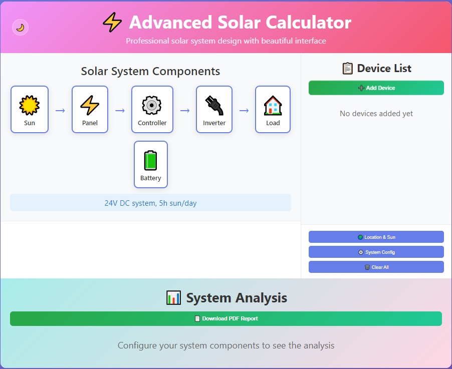

# 🌞 Off-Grid Solar Calculator

A professional, responsive web application for designing off-grid solar power systems. Calculate solar panel requirements, battery capacity, inverter sizing, and more with an intuitive interface.

[](https://yourusername.github.io/off-grid-solar-calculator)
[](https://opensource.org/licenses/MIT)

## ✨ Features

- **🎯 Accurate Calculations**: Professional-grade solar system sizing with real-world derating factors
- **🌍 Location-Aware**: Built-in solar data for major cities worldwide + GPS location detection
- **📱 Responsive Design**: Works perfectly on desktop, tablet, and mobile devices
- **🌙 Dark Mode**: Toggle between light and dark themes
- **📊 Visual System Flow**: Interactive component diagram showing energy flow
- **📄 PDF Reports**: Generate detailed system design reports
- **⚡ Advanced Options**: Support for different generation patterns, autonomy periods, and efficiency settings
- **🔧 Flexible Device Input**: Add devices by wattage or voltage/current specifications

## 🚀 Live Demo

Visit the live application: **[Solar Calculator](https://achintha96.github.io/off-grid-solar-calculator)**

## 📸 Screenshots

### Main Interface


### System Configuration


### PDF Report Generation


## 🛠️ Technology Stack

- **Frontend**: HTML5, CSS3, JavaScript (ES6+)
- **Styling**: CSS Grid, Flexbox, Custom CSS Variables
- **PDF Generation**: jsPDF library
- **Charts**: HTML5 Canvas for generation curves
- **Icons**: Unicode emojis for universal compatibility
- **Responsive**: CSS Media Queries

## 🏗️ Installation & Usage

### Option 1: Direct Download
1. Download the repository as ZIP
2. Extract and open `index.html` in your browser
3. Start calculating your solar system!

### Option 2: Clone Repository
```bash
git clone https://github.com/yourusername/off-grid-solar-calculator.git
cd off-grid-solar-calculator
```

Open `index.html` in your web browser or serve with a local server:

```bash
# Using Python 3
python -m http.server 8000

# Using Node.js (if you have http-server installed)
npx http-server

# Using PHP
php -S localhost:8000
```

## 📖 How to Use

1. **Configure Location**: Click the sun icon to set your location and daily sun hours
2. **Add Devices**: Use the device panel to add electrical appliances with their power consumption
3. **System Settings**: Configure system voltage, efficiency, and safety margins
4. **View Results**: The calculator automatically displays required solar panels, batteries, and other components
5. **Generate Report**: Download a detailed PDF report with all calculations and recommendations

## 🧮 Calculation Methodology

The calculator uses industry-standard formulas and safety factors:

- **Energy Consumption**: Separates daytime and nighttime loads for accurate battery sizing
- **Solar Panel Sizing**: Accounts for system efficiency, panel derating, and safety margins
- **Battery Capacity**: Considers depth of discharge (DOD) and autonomy requirements
- **Inverter Sizing**: Based on peak power demand with safety margins
- **Charge Controller**: Sized for solar panel output with appropriate safety factors

## 🌍 Supported Locations

Built-in solar data for major cities including:
- Sri Lanka: Colombo, Kandy, Galle
- USA: New York, Los Angeles
- Europe: London, Berlin
- Asia: Tokyo, Mumbai, Delhi
- Others: Sydney, Cairo
- Plus GPS location detection for any location

## 🎨 Customization

The application supports extensive customization:

- **System Voltage**: 12V, 24V, 36V, 48V, 60V DC systems
- **Battery Types**: Different DOD settings for Lead-acid, Lithium, etc.
- **Generation Patterns**: Linear, Gaussian, or custom solar generation curves
- **Efficiency Settings**: Adjustable system efficiency and component derating factors
- **Safety Margins**: Configurable safety factors for reliable operation

## 📋 Device Presets

Pre-configured device types with typical power consumption:
- 💻 Laptop (65W)
- 📺 TV (150W)
- 🌀 Fan (75W)
- 🧊 Refrigerator (200W)
- 💡 LED Bulb (10W)
- 💡 CFL Bulb (23W)
- 🔥 Microwave (1000W)
- 👕 Washing Machine (500W)

## 🤝 Contributing

Contributions are welcome! Please feel free to submit issues and enhancement requests.

1. Fork the repository
2. Create a feature branch (`git checkout -b feature/amazing-feature`)
3. Commit your changes (`git commit -m 'Add amazing feature'`)
4. Push to the branch (`git push origin feature/amazing-feature`)
5. Open a Pull Request

## 📝 License

This project is licensed under the MIT License - see the [LICENSE](LICENSE) file for details.

## 🙏 Acknowledgments

- Solar irradiance data from various meteorological sources
- Component specifications based on industry standards
- UI/UX inspired by modern web design practices

## 📞 Support

If you have questions or need help:
- 🐛 **Bug Reports**: [Create an issue](https://github.com/yourusername/off-grid-solar-calculator/issues)
- 💡 **Feature Requests**: [Create an issue](https://github.com/yourusername/off-grid-solar-calculator/issues)
- 📧 **Contact**: your.email@example.com

## 🔄 Version History

- **v1.0.0** - Initial release with core calculation features
- **v1.1.0** - Added dark mode and responsive design
- **v1.2.0** - PDF report generation and advanced options

---

**⭐ Star this repository if you find it helpful!**

Made with ❤️ for the renewable energy community
